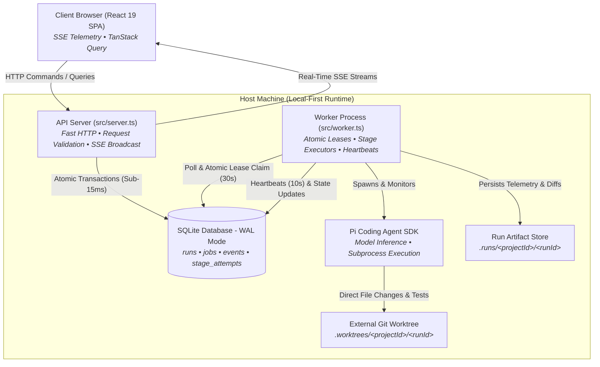
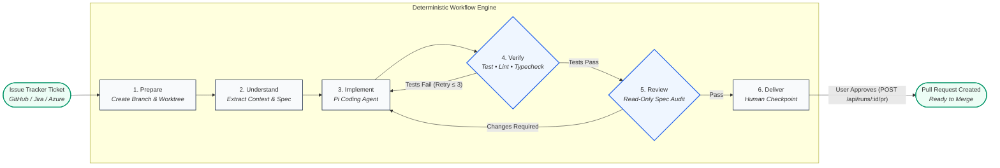

# X-Factory

Deterministic autonomous software engineering workbench: **ticket → understand → implement → verify → review → deliver**.

X-Factory is an autonomous, local-first software engineering factory powered by Bun, TypeScript, SQLite WAL, and [Pi](https://pi.dev) coding agents. It takes an approved issue ticket, acceptance criteria, and technical plan, executes code changes in isolated external Git worktrees, enforces deterministic verification with bounded self-repair, conducts an independent read-only review, and presents a human checkpoint before pull request creation.

---

## Why X-Factory?

Coding agents generate code quickly, but unconstrained agents introduce subtle bugs, broken tests, style violations, and repository pollution. 

X-Factory establishes a deterministic, fault-tolerant runtime around the agent:
- **Zero Hallucinated Progress**: Changes must pass your real compiler, linter, and test suite.
- **Isolated Execution**: Agent modifications happen exclusively in dedicated external Git worktrees (`.worktrees/`), never on your active working branch.
- **Bounded Self-Repair**: When tests fail, X-Factory captures compiler and test outputs, feeds diagnostics back to the agent, and attempts automated repair (up to 3 cycles).
- **Independent Adversarial Review**: A separate, read-only agent evaluates the diff against the original ticket acceptance criteria before human handoff.
- **Crash-Resilient Multi-Process Architecture**: Web serving and background execution run in decoupled processes coordinated through durable SQLite leases.

---

## Architecture & Process Topology

X-Factory separates HTTP request handling, persistent storage, and autonomous agent orchestration across discrete process boundaries on a single host:



### Core Invariants

1. **API Invariant**: `src/server.ts` handles HTTP routing, payload validation, and SQLite persistence. It **never** executes workflow stages, spawns agents, or runs git commands. Every command returns an HTTP response in under 15ms.
2. **Worker Invariant**: `src/worker.ts` is an independent background Bun process. It polls SQLite, atomically claims jobs with 30-second leases, emits 10-second heartbeats, drives Pi agent sessions, and records execution telemetry.
3. **Database Invariant**: SQLite operating in Write-Ahead Logging (`PRAGMA journal_mode = WAL;`) is the single source of truth for runtime state. Mutations enforce optimistic concurrency control via a monotonic `revision` counter.
4. **Filesystem Invariant**: Large blobs, logs, and Git worktrees live on disk under `~/.x-factory/`. SQLite stores metadata and path references, never raw file blobs.

---

## Workflow Lifecycle

Every task advances through a strictly governed finite state machine:



1. **Prepare**: Allocates a unique run ID, creates branch `xfactory/<ticket>-<id>`, and provisions an isolated Git worktree outside the target repo.
2. **Understand**: Synthesizes codebase symbols, documentation, and tickets into an `ImplementationContext` artifact.
3. **Implement**: Spawns Pi agent session in the dedicated worktree. Supports live interactive steering and cancellation.
4. **Verify**: Deterministically executes target repository test, typecheck, and lint commands. Checks for repo pollution and unintended file deletions. If checks fail, feeds errors back to the agent for bounded repair (up to 3 attempts).
5. **Review**: Launches a fresh, read-only Pi agent session to evaluate the diff against the ticket acceptance criteria.
6. **Deliver**: Human-in-the-loop gate. Displays test evidence, review scorecards, and git patch in the UI. When approved, commits, pushes, and opens a pull request.

---

## Quickstart

### 1. Prerequisites

- **Bun** ≥ 1.2.3
- **Git CLI**
- **GitHub CLI** (`gh`) authenticated (`gh auth login`) or **Azure DevOps CLI**
- **Model Credentials**: `ANTHROPIC_API_KEY` set in your environment (default: Claude 3.7 Sonnet)

### 2. Installation

```bash
# Clone the repository
git clone https://github.com/tkz96/x-factory.git
cd x-factory

# Install dependencies
bun install
```

### 3. Configure Target Projects

Configure target repositories in `config/projects.json`:

```json
{
  "projects": [
    {
      "id": "my-app",
      "name": "My Application",
      "repositoryPath": "/absolute/path/to/my-app",
      "defaultBranch": "main",
      "testCommand": "bun test",
      "typecheckCommand": "bun run typecheck",
      "lintCommand": "bun run lint"
    }
  ]
}
```

### 4. Start the Engine

X-Factory uses a multi-process runtime consisting of an **API Server** and a **Background Worker**. You can run in **Production Mode** (pre-bundled UI served directly from port 3777) or **Development Mode** (Vite on port 5173 with instant Hot Module Replacement).

#### Option A: Production Mode (Standalone on Port 3777)

In production mode, the API server directly serves the pre-bundled React 19 single-page application from `dist/public/`. This is the recommended mode for everyday workflow runs.

```bash
# 1. Build the production bundle into dist/public/
bun run build

# 2. Terminal 1: Start the API server in production mode (port 3777)
bun run start:production
# (Equivalent to: NODE_ENV=production bun src/server.ts)

# 3. Terminal 2: Start the background worker process
bun run worker
```

👉 Open **[http://localhost:3777](http://localhost:3777)** in your browser.

---

#### Option B: Development Mode (With Vite Hot Module Replacement on Port 5173)

When developing or modifying React components, start the Vite development server. Vite compiles TypeScript/JSX on the fly with instant Hot Module Replacement (HMR) and automatically proxies all `/api` and `/reference` calls to port 3777:

```bash
# 1. Terminal 1: Start the backend API server with watch mode (port 3777)
bun run dev

# 2. Terminal 2: Start the Vite frontend dev server (port 5173)
bun run dev:frontend

# 3. Terminal 3: Start the background worker process
bun run worker
```

👉 Open **[http://localhost:5173](http://localhost:5173)** in your browser.

> [!NOTE]
> **Why port 3777 shows a blank screen in development mode:**
> In raw development mode (`bun run dev`), the server serves the uncompiled HTML template containing `<script type="module" src="/src/frontend/main.tsx"></script>`. Browsers cannot execute raw `.tsx` files directly. To view the UI in development, always open the Vite server at **`http://localhost:5173`**, or run `bun run build && bun run start:production` to view the compiled bundle on port **`3777`**.

---

## Issue Tracker Automation & Work Queue

X-Factory automatically polls configured trackers for active tickets ready for implementation. To route a ticket into the automated work queue, apply the keyword `agentic-workflow`:

| Tracker | Native Taxonomy | How to Apply | Filter Query |
| :--- | :--- | :--- | :--- |
| **Azure DevOps** | **Tag** (`System.Tags`) | Click **`+ Add Tag`** below title → `agentic-workflow` | `[System.Tags] CONTAINS 'agentic-workflow'` |
| **GitHub Issues** | **Label** | Select **Labels** in sidebar → `agentic-workflow` | `is:open label:agentic-workflow` |
| **Jira Software** | **Label** | Add `agentic-workflow` to **Labels** field | `labels = 'agentic-workflow' AND statusCategory != Done` |

> [!IMPORTANT]
> **Strict Enforcement for Azure DevOps:** X-Factory requires the native work item **Tag** (`+ Add Tag`). Custom form fields named `Label` are ignored to guarantee board and query compatibility.

---

## Project Structure

```text
x-factory/
├── src/
│   ├── server.ts             # Native Bun HTTP server, REST routing, and SSE registry
│   ├── worker.ts             # Background worker execution loop, leases, and heartbeats
│   ├── state-machine.ts      # 11×11 finite state machine and transition validator
│   ├── db/                   # SQLite connection, schema migrations (v1–v6), and repositories
│   ├── executors/            # Stage executors (prepare, understand, implement, verify, review, deliver)
│   ├── frontend/             # React 19 SPA, Apple HIG tokens, TanStack Query, Vite
│   ├── http/                 # Controllers, Zod input schemas, static asset serving
│   ├── trackers/             # Azure DevOps, GitHub Issues, and Jira polling adapters
│   └── diagnostics/          # X-Request-ID correlation and worker telemetry registry
├── docs/                     # Comprehensive Diátaxis documentation suite
│   ├── tutorials/            # Learning-oriented lessons for beginners
│   ├── how-to/               # Goal-oriented operational and disaster recovery guides
│   ├── reference/            # Factual schemas, transition matrices, and audit criteria
│   └── explanation/          # Architectural rationale, process boundaries, and design trade-offs
├── config/                   # Target project configuration (projects.json)
└── test/                     # 73 test suites with >97% code coverage ratchet
```

---

## Developer Commands

```bash
bun run dev                         # Start backend API server with watch mode
bun run dev:frontend                # Start Vite frontend development server (port 5173 with HMR)
bun run start:production            # Start server in production mode serving pre-built assets (port 3777)
bun run worker                      # Start independent background worker process
bun test                            # Run all automated tests (enforces 80% coverage ratchet)
bun run test:integration            # Run server lifecycle, API contracts, and SSE tests
bun run test:frontend-smoke         # Run UI shell, navigation, and modal structural smoke tests
bun run build                       # Bundle and assemble complete production assets into dist/public
bun run typecheck                   # Verify backend TypeScript types (tsc --noEmit)
bun run typecheck:frontend          # Verify browser TypeScript types (tsc frontend config)
bun run lint                        # Check formatting and lint rules (biome check .)
bun run lint:fix                    # Autofix formatting and safe lint rules
bun run check:knip                  # Detect unused exports, files, and dependencies
bun run check:cycles                # Verify zero circular import dependencies (dpdm)
bun run check:fallow                # Verify architectural boundaries and maintainability
bun scripts/backup.ts               # Generate atomic VACUUM snapshot and artifact archive
```

---

## Frontend Development & Design System

The X-Factory workbench frontend is a local-first Single Page Application designed according to the **Apple Human Interface Guidelines (HIG)**:

- **Stack**: React 19, Vite 6, React Router 7, and TanStack Query 5.
- **Real-Time Telemetry**: Server-Sent Events (SSE) update the TanStack Query cache dynamically without page reloads or layout shifts.
- **Design Foundations**: Layout, typography, spacing, and colors follow [`DESIGN.md`](file:///Users/talhazuberi/x-factory/DESIGN.md) using curated semantic CSS variables with automatic dark and light theme switching.

### Modular CSS Architecture

To prevent style drift and bloated component files, frontend styling is structured into discrete layers under `src/frontend/styles/`:

```text
src/frontend/
├── styles/
│   ├── index.css             # Entrypoint imported once in main.tsx
│   ├── tokens.css            # 8pt spacing grid, typography scale, radii, and semantic colors
│   ├── base.css              # HTML resets, system font stack, and custom scrollbars
│   ├── shared/               # Reusable UI component patterns
│   │   ├── buttons.css       # Primary, secondary, danger, and ghost buttons
│   │   ├── cards.css         # Apple HIG card materials, borders, and hover elevations
│   │   ├── forms.css         # Inputs, selects, textareas, and focus rings
│   │   ├── badges.css        # State pills and workflow stage indicators
│   │   ├── icons.css         # Optical sizing and SVG sprite alignment
│   │   └── scrollbar.css     # Consistent slim macOS-style scrollbars
│   └── utilities.css         # Spacing, typography, color, and layout modifiers
├── components/               # Components with co-located *.css files
└── views/                    # Top-level route views with co-located *.css files
```

### Developer Guidelines & Quality Invariants

When developing or modifying UI components:

1. **Zero Inline Styles (`style={{...}}`)**:
   Inline style declarations in `.tsx` files are strictly prohibited. Always use semantic CSS tokens, utility classes (`.mt-4`, `.flex-between`, etc.), or a co-located component stylesheet.
2. **Co-located Component Styles**:
   Any view or component requiring bespoke styling must maintain an adjacent `.css` file (e.g. `QueueView.css` alongside `QueueView.tsx`) and import it explicitly (`import "./QueueView.css"`).
3. **No Hardcoded Values**:
   Never hardcode hex colors (`#fff`), arbitrary pixel spacing (`margin: 17px`), or arbitrary font sizes. Use semantic tokens defined in `tokens.css` (`var(--text)`, `var(--space-4)`, `var(--text-headline)`).
4. **CI Enforcement**:
   The frontend design system is guarded by automated anti-drift tests:
   ```bash
   bun run typecheck:frontend     # TypeScript validation for browser bundle
   bun run test:frontend-smoke    # Validates zero inline styles, CSS layering, and DOM structure
   ```

---

## Documentation

Full project documentation is structured using the [Diátaxis Framework](https://diataxis.fr) and written in [ASD-STE100 Simplified Technical English](file:///Users/talhazuberi/x-factory/docs/README.md):

| Quadrant | Purpose | Key Documents |
|---|---|---|
| **[Tutorials](file:///Users/talhazuberi/x-factory/docs/tutorials/first-agent-run.md)** | Learning-oriented guide for newcomers | [Run Your First Agent Workflow](file:///Users/talhazuberi/x-factory/docs/tutorials/first-agent-run.md) |
| **[How-To Guides](file:///Users/talhazuberi/x-factory/docs/how-to/verify-worker-and-pi-session.md)** | Step-by-step problem-solving recipes | [Verify Worker Leases & Sessions](file:///Users/talhazuberi/x-factory/docs/how-to/verify-worker-and-pi-session.md)<br/>[Database Backup & Disaster Recovery](file:///Users/talhazuberi/x-factory/docs/how-to/backup-and-restore-database.md) |
| **[Reference](file:///Users/talhazuberi/x-factory/docs/reference/database-schema.md)** | Factual technical specifications | [Database Schema & Entities](file:///Users/talhazuberi/x-factory/docs/reference/database-schema.md)<br/>[State Machine Transition Matrix](file:///Users/talhazuberi/x-factory/docs/reference/state-machine-matrix.md)<br/>[Production Readiness Checklist](file:///Users/talhazuberi/x-factory/docs/reference/production-readiness-checklist.md) |
| **[Explanation](file:///Users/talhazuberi/x-factory/docs/explanation/process-boundaries-and-topology.md)** | Architectural understanding & "why" | [Process Boundaries & System Topology](file:///Users/talhazuberi/x-factory/docs/explanation/process-boundaries-and-topology.md)<br/>[UI State & Event Streaming](file:///Users/talhazuberi/x-factory/docs/explanation/ui-state-and-event-streaming.md) |

For the central documentation index, visit [`docs/README.md`](file:///Users/talhazuberi/x-factory/docs/README.md).

---

## License

MIT
