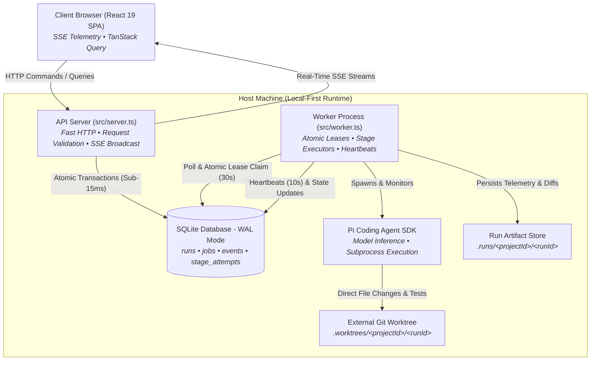

# X-Factory

Deterministic autonomous software engineering workbench: **ticket → understand → implement → verify → review → deliver**.

X-Factory is an autonomous, local-first software engineering factory powered by Bun, TypeScript, SQLite WAL, and [Pi](https://pi.dev) coding agents. It takes an approved issue ticket, acceptance criteria, and technical plan, executes code changes in isolated external Git worktrees, enforces deterministic verification with bounded self-repair, conducts an independent read-only review, and presents a human checkpoint before pull request creation.

---

## Why X-Factory?

Coding agents generate code quickly, but unconstrained agents introduce subtle bugs, broken tests, style violations, and repository pollution. 

X-Factory establishes a deterministic, fault-tolerant runtime around the agent:
- **Zero Hallucinated Progress**: Changes must pass your real compiler, linter, and test suite.
- **Isolated Execution**: Agent modifications happen exclusively in dedicated external Git worktrees (`.worktrees/`), never on your active working branch.
- **Bounded Self-Repair**: When tests fail, X-Factory captures compiler and test outputs, feeds diagnostics back to the agent, and attempts automated repair (up to 3 cycles).
- **Independent Adversarial Review**: A separate, read-only agent evaluates the diff against the original ticket acceptance criteria before human handoff.
- **Crash-Resilient Multi-Process Architecture**: Web serving and background execution run in decoupled processes coordinated through durable SQLite leases.

---

## Architecture & Process Topology

X-Factory separates HTTP request handling, persistent storage, and autonomous agent orchestration across discrete process boundaries on a single host:


```mermaid
graph TD
    User["Client Browser (React 19 SPA)<br/><i>SSE Telemetry • TanStack Query</i>"]
    
    subgraph Host["Host Machine (Local-First Runtime)"]
        API["API Server (src/server.ts)<br/><i>Fast HTTP • Request Validation • SSE Broadcast</i>"]
        DB[(SQLite Database - WAL Mode<br/><i>runs • jobs • events • stage_attempts</i>)]
        Worker["Worker Process (src/worker.ts)<br/><i>Atomic Leases • Stage Executors • Heartbeats</i>"]
        Pi["Pi Coding Agent SDK<br/><i>Model Inference • Subprocess Execution</i>"]
        Worktree["External Git Worktree<br/><i>.worktrees/&lt;projectId&gt;/&lt;runId&gt;</i>"]
        Artifacts["Run Artifact Store<br/><i>.runs/&lt;projectId&gt;/&lt;runId&gt;</i>"]
    end

    User -->|"HTTP Commands / Queries"| API
    API -->|"Real-Time SSE Streams"| User
    API -->|"Atomic Transactions (Sub-15ms)"| DB
    Worker -->|"Poll & Atomic Lease Claim (30s)"| DB
    Worker -->|"Heartbeats (10s) & State Updates"| DB
    Worker -->|"Spawns & Monitors"| Pi
    Pi -->|"Direct File Changes & Tests"| Worktree
    Worker -->|"Persists Telemetry & Diffs"| Artifacts
```

### Core Invariants

1. **API Invariant**: `src/server.ts` handles HTTP routing, payload validation, and SQLite persistence. It **never** executes workflow stages, spawns agents, or runs git commands. Every command returns an HTTP response in under 15ms.
2. **Worker Invariant**: `src/worker.ts` is an independent background Bun process. It polls SQLite, atomically claims jobs with 30-second leases, emits 10-second heartbeats, drives Pi agent sessions, and records execution telemetry.
3. **Database Invariant**: SQLite operating in Write-Ahead Logging (`PRAGMA journal_mode = WAL;`) is the single source of truth for runtime state. Mutations enforce optimistic concurrency control via a monotonic `revision` counter.
4. **Filesystem Invariant**: Large blobs, logs, and Git worktrees live on disk under `~/.x-factory/`. SQLite stores metadata and path references, never raw file blobs.

---

## Workflow Lifecycle

Every task advances through a strictly governed finite state machine:


```mermaid
flowchart LR
    Ticket([Issue Tracker Ticket<br/><i>GitHub / Jira / Azure</i>]) --> Prepare
    
    subgraph Pipeline["Canonical Workflow Engine"]
        Prepare["1. Prepare<br/><i>Branch & Worktree</i>"]
        Understand["2. Understand<br/><i>Extract Context</i>"]
        Chk1{{"Human Approval<br/><i>Understanding</i>"}}
        Plan["3. Plan<br/><i>Synthesize Tasks</i>"]
        Chk2{{"Human Approval<br/><i>Plan</i>"}}
        Execute["4. Execute<br/><i>Autonomous Ralph Loop</i>"]
        Review{{"5. Review<br/><i>Human Code Review</i>"}}
        Deliver["6. Deliver<br/><i>Pull Request Creation</i>"]
    end

    Prepare --> Understand --> Chk1
    Chk1 -->|"Approved"| Plan
    Chk1 -->|"Requeue"| Understand
    Plan --> Chk2
    Chk2 -->|"Approved"| Execute
    Chk2 -->|"Requeue"| Understand
    Execute --> Review
    Review -->|"Approved"| Deliver
    Review -->|"Feedback / Requeue"| Understand
    
    Deliver -->|"POST /api/runs/:id/pr"| PR([Pull Request Created<br/><i>Ready to Merge</i>])
    
    classDef stage fill:#f8fafc,stroke:#334155,stroke-width:1.5px;
    classDef checkpoint fill:#eff6ff,stroke:#2563eb,stroke-width:2px;
    classDef terminal fill:#ecfdf5,stroke:#059669,stroke-width:2px;
    class Prepare,Understand,Plan,Execute,Deliver stage;
    class Chk1,Chk2,Review checkpoint;
    class Ticket,PR terminal;
```

1. **Prepare**: Allocates a unique run ID, creates branch `factory/<ticket>-<id>`, and provisions an isolated Git worktree outside the target repo.
2. **Understand**: Synthesizes codebase symbols, documentation, and tickets into an `ImplementationContext` artifact. Pauses at human checkpoint `awaiting_understanding_approval`.
3. **Plan**: Synthesizes structured markdown task lists and constraints from acceptance criteria. Pauses at human checkpoint `awaiting_plan_approval`.
4. **Execute**: Drives the autonomous Ralph execution loop in the dedicated worktree using Matt Pocock TDD protocols with sanitized environment controls, streaming real-time iteration events. Execution completes with an automated adversarial code review against acceptance criteria.
5. **Review**: Operator review gate at `awaiting_review`. Displays diff, artifacts, and execution evidence in the UI. Operator may approve or requeue with feedback.
6. **Deliver**: Publishes branch, creates pull request on GitHub or Azure DevOps, and transitions run to `pr_created`.

---

## Quickstart

### Prerequisites

- **Bun** ≥ 1.4.0 ([install](https://bun.sh))
- **Git CLI**
- **LLM API Key**: An API key from Anthropic, Google (Gemini), or OpenAI

### Setup

```bash
git clone https://github.com/tkz96/x-factory.git
cd x-factory
bun install
cp .env.example .env   # Add your LLM_API_KEY
bun run dev
```

Open **http://localhost:5173** in your browser.

On first launch, X-Factory starts with an empty project list. Click **"Onboard Project"** to connect your first Git repository, then click **"+ New Run"** to trigger your first autonomous workflow.

> **Production Mode**: To run without Vite HMR on a single port:
> ```bash
> bun run build
> bun run start:production  # Serves on http://localhost:3777
> bun run worker            # In a second terminal
> ```

---

## Issue Tracker Automation & Work Queue

X-Factory automatically polls configured trackers for active tickets ready for implementation. To route a ticket into the automated work queue, apply the keyword `agentic-workflow`:

| Tracker | Native Taxonomy | How to Apply | Filter Query |
| :--- | :--- | :--- | :--- |
| **Azure DevOps** | **Tag** (`System.Tags`) | Click **`+ Add Tag`** below title → `agentic-workflow` | `[System.Tags] CONTAINS 'agentic-workflow'` |
| **GitHub Issues** | **Label** | Select **Labels** in sidebar → `agentic-workflow` | `is:open label:agentic-workflow` |
| **Jira Software** | **Label** | Add `agentic-workflow` to **Labels** field | `labels = 'agentic-workflow' AND statusCategory != Done` |

> [!IMPORTANT]
> **Strict Enforcement for Azure DevOps:** X-Factory requires the native work item **Tag** (`+ Add Tag`). Custom form fields named `Label` are ignored to guarantee board and query compatibility.

---

## Project Structure

```text
x-factory/
├── src/
│   ├── server.ts             # Native Bun HTTP server, REST routing, and SSE registry
│   ├── worker.ts             # Background worker execution loop, leases, and heartbeats
│   ├── state-machine.ts      # finite state machine and transition validator
│   ├── db/                   # SQLite connection, schema migrations (v1–v6), and repositories
│   ├── executors/            # Stage executors (prepare, understand, plan, execute, review, deliver)
│   ├── frontend/             # React 19 SPA, Apple HIG tokens, TanStack Query, Vite
│   ├── http/                 # Controllers, Zod input schemas, static asset serving
│   ├── trackers/             # Azure DevOps, GitHub Issues, and Jira polling adapters
│   └── diagnostics/          # X-Request-ID correlation and worker telemetry registry
├── docs/                     # Comprehensive Diátaxis documentation suite
│   ├── tutorials/            # Learning-oriented lessons for beginners
│   ├── how-to/               # Goal-oriented operational and disaster recovery guides
│   ├── reference/            # Factual schemas, transition matrices, and audit criteria
│   └── explanation/          # Architectural rationale, process boundaries, and design trade-offs
├── config/                   # Target project configuration (projects.json)
└── test/                     # 73 test suites with >97% code coverage ratchet
```

---

## Developer Commands

```bash
bun run dev                         # Start backend API server with watch mode
bun run dev:frontend                # Start Vite frontend development server (port 5173 with HMR)
bun run start:production            # Start server in production mode serving pre-built assets (port 3777)
bun run worker                      # Start independent background worker process
bun test                            # Run all automated tests (enforces 80% coverage ratchet)
bun run test:integration            # Run server lifecycle, API contracts, and SSE tests
bun run test:frontend-smoke         # Run UI shell, navigation, and modal structural smoke tests
bun run build                       # Bundle and assemble complete production assets into dist/public
bun run typecheck                   # Verify backend TypeScript types (tsc --noEmit)
bun run typecheck:frontend          # Verify browser TypeScript types (tsc frontend config)
bun run lint                        # Check formatting and lint rules (biome check .)
bun run lint:fix                    # Autofix formatting and safe lint rules
bun run check:knip                  # Detect unused exports, files, and dependencies
bun run check:cycles                # Verify zero circular import dependencies (dpdm)
bun run check:fallow                # Verify architectural boundaries and maintainability
bun scripts/backup.ts               # Generate atomic VACUUM snapshot and artifact archive
```

---

## Frontend Development & Design System

The X-Factory workbench frontend is a local-first Single Page Application designed according to the **Apple Human Interface Guidelines (HIG)**:

- **Stack**: React 19, Vite 6, React Router 7, and TanStack Query 5.
- **Real-Time Telemetry**: Server-Sent Events (SSE) update the TanStack Query cache dynamically without page reloads or layout shifts.
- **Design Foundations**: Layout, typography, spacing, and colors follow [`DESIGN.md`](./DESIGN.md) using curated semantic CSS variables with automatic dark and light theme switching.

### Modular CSS Architecture

To prevent style drift and bloated component files, frontend styling is structured into discrete layers under `src/frontend/styles/`:

```text
src/frontend/
├── styles/
│   ├── index.css             # Entrypoint imported once in main.tsx
│   ├── tokens.css            # 8pt spacing grid, typography scale, radii, and semantic colors
│   ├── base.css              # HTML resets, system font stack, and custom scrollbars
│   ├── shared/               # Reusable UI component patterns
│   │   ├── buttons.css       # Primary, secondary, danger, and ghost buttons
│   │   ├── cards.css         # Apple HIG card materials, borders, and hover elevations
│   │   ├── forms.css         # Inputs, selects, textareas, and focus rings
│   │   ├── badges.css        # State pills and workflow stage indicators
│   │   ├── icons.css         # Optical sizing and SVG sprite alignment
│   │   └── scrollbar.css     # Consistent slim macOS-style scrollbars
│   └── utilities.css         # Spacing, typography, color, and layout modifiers
├── components/               # Components with co-located *.css files
└── views/                    # Top-level route views with co-located *.css files
```

### Developer Guidelines & Quality Invariants

When developing or modifying UI components:

1. **Zero Inline Styles (`style={{...}}`)**:
   Inline style declarations in `.tsx` files are strictly prohibited. Always use semantic CSS tokens, utility classes (`.mt-4`, `.flex-between`, etc.), or a co-located component stylesheet.
2. **Co-located Component Styles**:
   Any view or component requiring bespoke styling must maintain an adjacent `.css` file (e.g. `QueueView.css` alongside `QueueView.tsx`) and import it explicitly (`import "./QueueView.css"`).
3. **No Hardcoded Values**:
   Never hardcode hex colors (`#fff`), arbitrary pixel spacing (`margin: 17px`), or arbitrary font sizes. Use semantic tokens defined in `tokens.css` (`var(--text)`, `var(--space-4)`, `var(--text-headline)`).
4. **CI Enforcement**:
   The frontend design system is guarded by automated anti-drift tests:
   ```bash
   bun run typecheck:frontend     # TypeScript validation for browser bundle
   bun run test:frontend-smoke    # Validates zero inline styles, CSS layering, and DOM structure
   ```

---

## Documentation

Full project documentation is structured using the [Diátaxis Framework](https://diataxis.fr) and written in [ASD-STE100 Simplified Technical English](./docs/README.md):

| Quadrant | Purpose | Key Documents |
|---|---|---|
| **[Tutorials](./docs/tutorials/first-agent-run.md)** | Learning-oriented guide for newcomers | [Run Your First Agent Workflow](./docs/tutorials/first-agent-run.md) |
| **[How-To Guides](./docs/how-to/verify-worker-and-pi-session.md)** | Step-by-step problem-solving recipes | [Verify Worker Leases & Sessions](./docs/how-to/verify-worker-and-pi-session.md)<br/>[Database Backup & Disaster Recovery](./docs/how-to/backup-and-restore-database.md) |
| **[Reference](./docs/reference/database-schema.md)** | Factual technical specifications | [Database Schema & Entities](./docs/reference/database-schema.md)<br/>[State Machine Transition Matrix](./docs/reference/state-machine-matrix.md)<br/>[Production Readiness Checklist](./docs/reference/production-readiness-checklist.md) |
| **[Explanation](./docs/explanation/process-boundaries-and-topology.md)** | Architectural understanding & "why" | [Process Boundaries & System Topology](./docs/explanation/process-boundaries-and-topology.md)<br/>[UI State & Event Streaming](./docs/explanation/ui-state-and-event-streaming.md) |

For the central documentation index, visit [`docs/README.md`](./docs/README.md).

---

## License

MIT
